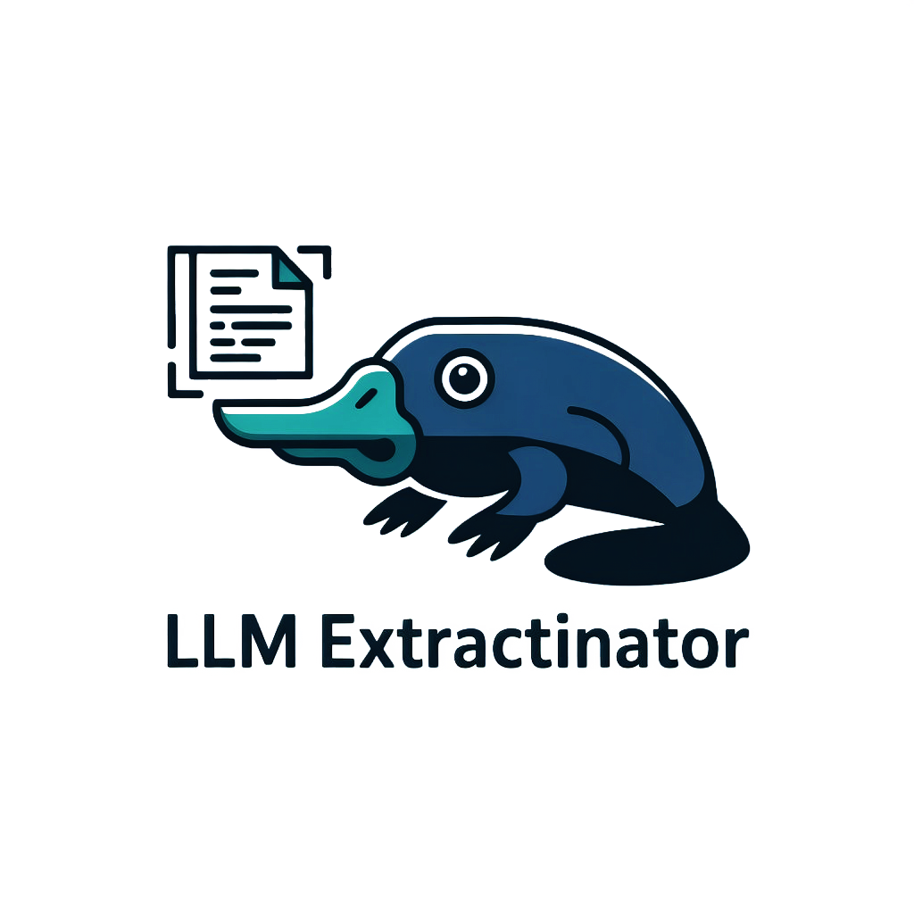

<p align="center">
  
</p>

<h1 align="center">LLM Extractinator</h1>

<p align="center">
Turn unstructured text into <b>Pydantic-validated structured data</b> using local LLMs via Ollama.
</p>

<p align="center">


</p>

> ⚠️ **Prototype.** This project is under active development — interfaces, task formats, and directory names may still change. LLMs can also hallucinate, so **always inspect and validate the output** before using it downstream.

LLM Extractinator reads unstructured text (reports, clinical notes, the text column of a CSV) and returns **structured, schema-validated data**. You describe the shape you want as a Pydantic model, and the tool prompts a local LLM (via [Ollama](https://ollama.com)) to fill it in and validates the result against your schema.

It ships in three flavours that all do the same thing:

| Interface | Command | Best for |
|---|---|---|
| **Studio** — a Streamlit app | `launch-extractinator` | Designing schemas and tasks with no code, then running and inspecting them |
| **CLI** | `extractinate` | Repeatable, scriptable runs on a workstation or server |
| **Python API** | `from llm_extractinator import extractinate` | Calling extraction from your own scripts or notebooks |

📚 **Full documentation:** https://diagnijmegen.github.io/llm_extractinator/

---

## How it works

```
        ┌────────────┐     ┌───────────────┐     ┌──────────────┐     ┌─────────────┐
Text →  │  Dataset   │  +  │ Output schema │  →  │  Local LLM   │  →  │  Validated  │
        │ (CSV/JSON) │     │  (Pydantic)   │     │  via Ollama  │     │ JSON output │
        └────────────┘     └───────────────┘     └──────────────┘     └─────────────┘
                    a Task JSON ties these together
```

You need three things, all described by a small **task file**:

1. a **dataset** — a CSV or JSON file with a text field to read from,
2. an **output schema** — a Pydantic model (`OutputParser`) describing the fields to extract, and
3. a **task JSON** — pointing at the dataset, the text field, and the schema.

You can create all three in the Studio, or write them by hand.

---

## 1. Installation

### 🐳 Recommended: Docker

The easiest and most reliable way to run LLM Extractinator is the **GPU-ready Docker image**. It bundles Python, **Ollama**, and the Studio into a single container, so the only thing you install is Docker itself — no environments, no separate Ollama setup.

Create the folders that will be mounted into the container, then start it:

```bash
mkdir -p data examples tasks output ollama_models

docker run --rm --gpus all \
  -p 127.0.0.1:8501:8501 \
  -p 11434:11434 \
  -v $(pwd)/data:/app/data \
  -v $(pwd)/examples:/app/examples \
  -v $(pwd)/tasks:/app/tasks \
  -v $(pwd)/output:/app/output \
  -v $(pwd)/ollama_models:/root/.ollama \
  lmmasters/llm_extractinator:latest
```

This launches the **Studio** at [http://127.0.0.1:8501](http://127.0.0.1:8501). Drop `--gpus all` to run CPU-only. Full details — including the Windows/PowerShell command and a shell mode — are in the [Docker guide](https://diagnijmegen.github.io/llm_extractinator/docker/).

### Alternative: local install

Prefer your own Python environment? You'll need **[Ollama](https://ollama.com)** installed and running separately (`curl -fsSL https://ollama.com/install.sh | sh` on Linux, or the installer from [ollama.com/download](https://ollama.com/download)). Then:

```bash
conda create -n llm_extractinator python=3.11
conda activate llm_extractinator
pip install llm_extractinator
```

(Or `pip install -e .` from a clone to hack on it.) See [Installation](https://diagnijmegen.github.io/llm_extractinator/installation/) for details. You don't need to pull a model yourself — the tool pulls the one you ask for on first use.

---

## 2. Quick start

If you started the **Docker image** above, the Studio is already running — open [http://127.0.0.1:8501](http://127.0.0.1:8501). From a local install, launch it with:

```bash
launch-extractinator
```

Either way, the Studio follows a simple **Task → Run → Results** flow: configure or build a task, run it while watching the logs, then explore the output record by record.

Once a task file exists, you can also run it from the terminal…

```bash
extractinate --task_id 1 --model_name "phi4"
```

…or from Python:

```python
from llm_extractinator import extractinate

extractinate(task_id=1, model_name="phi4")
```

For a complete first run — dataset, schema, task, output — follow the [Quickstart](https://diagnijmegen.github.io/llm_extractinator/quickstart/).

---

## 3. Task files

A **task** describes *what* to extract and *from where*. Task files live in `tasks/` and must be named `Task<NNN>...json`, where `<NNN>` is a zero-padded three-digit ID:

```text
tasks/
├── Task001.json               # ID 1 — the Studio saves this form
├── Task002_reports.json       # ID 2 — an optional _name suffix is allowed
└── parsers/
    └── report.py              # the output schema referenced below
```

A minimal task:

```json
{
  "Description": "Extract product name and price from each row of text",
  "Data_Path": "products.csv",
  "Input_Field": "text",
  "Parser_Format": "product_schema.py"
}
```

| Field | Meaning |
|---|---|
| `Description` | Plain-language instruction shown to the model |
| `Data_Path` | Dataset filename, relative to the data directory (`--data_dir`, default `data/`) |
| `Input_Field` | Column/key holding the text to read |
| `Parser_Format` | Python file in `tasks/parsers/` defining the `OutputParser` schema |
| `Example_Path` *(optional)* | Few-shot examples file, relative to `--example_dir` |

You reference a task on the CLI by its ID: `Task002_reports.json` → `--task_id 2`.

---

## 4. Output schemas

The **output schema** defines the fields to extract and their types. It's a plain Pydantic model whose top-level class **must** be named `OutputParser`:

```python
from pydantic import BaseModel

class OutputParser(BaseModel):
    product_name: str
    price: float
```

Don't want to write Python? Build one visually — the Studio has an **Output Schema Builder** (also available standalone via `build-parser`) that generates the file for you and saves it into `tasks/parsers/`.

See the [output-schema guide](https://diagnijmegen.github.io/llm_extractinator/parser/) for nested models, optional fields, and `Literal` choices.

---

## 5. Where results go

Each run writes to:

```text
output/<run_name>/<TaskName>-run<N>/nlp-predictions-dataset.json
```

Every record contains your **original input columns**, the **extracted fields**, and a `status` of `"success"` or `"failure"`. The Studio's **Results** tab lets you filter and inspect these interactively. Details in [Understanding output](https://diagnijmegen.github.io/llm_extractinator/output/).

---

## 6. Documentation map

| Page | What's in it |
|---|---|
| [Quickstart](https://diagnijmegen.github.io/llm_extractinator/quickstart/) | A complete first extraction, end to end |
| [Installation](https://diagnijmegen.github.io/llm_extractinator/installation/) | Python + Ollama setup |
| [Preparing data](https://diagnijmegen.github.io/llm_extractinator/preparing-data/) | What your CSV/JSON should look like |
| [Output schema](https://diagnijmegen.github.io/llm_extractinator/parser/) | Designing the Pydantic model |
| [Studio](https://diagnijmegen.github.io/llm_extractinator/studio/) | The Streamlit app, tab by tab |
| [CLI usage](https://diagnijmegen.github.io/llm_extractinator/cli/) & [Settings reference](https://diagnijmegen.github.io/llm_extractinator/settings-reference/) | Every flag and task field |
| [Few-shot prompting](https://diagnijmegen.github.io/llm_extractinator/examples/) | Guiding the model with examples |
| [Understanding output](https://diagnijmegen.github.io/llm_extractinator/output/) | Folder layout and record shape |
| [Troubleshooting](https://diagnijmegen.github.io/llm_extractinator/troubleshooting/) | Common errors and fixes |
| [Docker](https://diagnijmegen.github.io/llm_extractinator/docker/) & [CPU-only](https://diagnijmegen.github.io/llm_extractinator/cpu-only/) | Containers and no-GPU setups |

---

## 7. Contributing

Pull requests are welcome. If you change task naming, required fields, or CLI flags, please update the docs in the same PR so the two stay in sync.

---

## 8. Citation & attribution

If you use this tool in your research, please cite:

> https://doi.org/10.1093/jamiaopen/ooaf109

Developed by the **Oncology Research Group** at the Diagnostic Image Analysis Group (DIAG), Radboud University Medical Center.
🔗 [diagnijmegen.nl/research/oncology](https://www.diagnijmegen.nl/research/oncology/)

**Contact:**

| Name | Email |
|---|---|
| Luc Builtjes | [luc.builtjes@radboudumc.nl](mailto:luc.builtjes@radboudumc.nl) |
| Alessa Hering | [alessa.hering@radboudumc.nl](mailto:alessa.hering@radboudumc.nl) |
