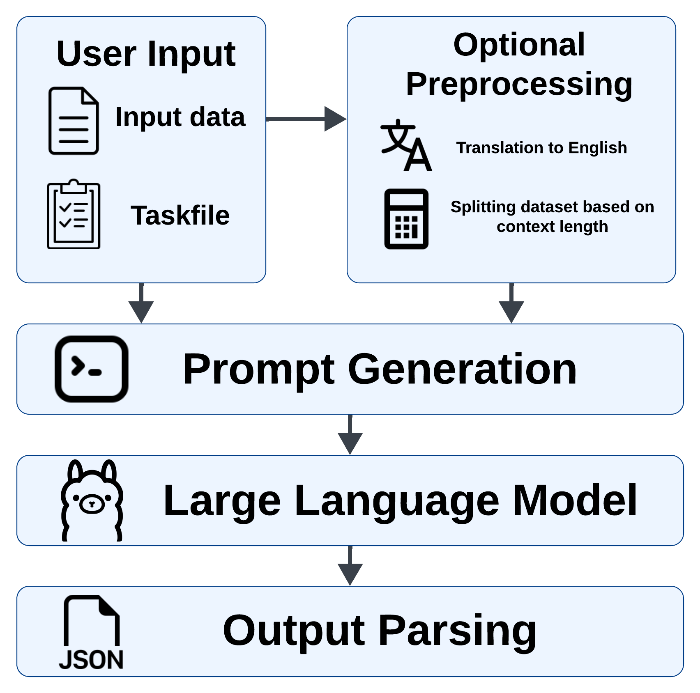

# 🧠 LLM Extractinator

> ⚠️ **Prototype Warning:** This tool is in active development and may change significantly. Always verify results!

**LLM Extractinator** enables efficient extraction of structured data from unstructured text using large language models (LLMs).  
It supports flexible configuration, task setup, and can be used via both **CLI** and **Python interface**.

