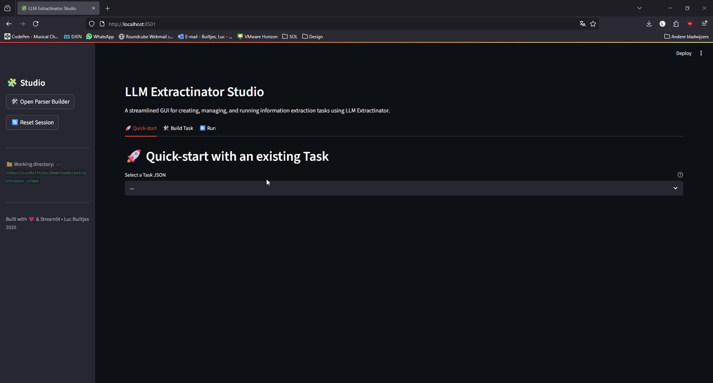

# The Studio

The Studio is the **interactive, no-code** way to use LLM Extractinator. Launch it with:

```bash
launch-extractinator
```

This starts a Streamlit app, usually at [http://localhost:8501](http://localhost:8501).



Everything you do in the Studio produces the same task files and output as the CLI — so you can prototype here, then run the exact same task unattended on a server.

---

## Layout at a glance

The Studio follows a straight-line flow, left to right:

**Task → Run → Results**

A **status strip** under the header always shows where you stand — the current **Task**, the **Model**, and the **Latest run** — so you never lose track of state as you move between tabs. The dots turn teal once each is set.

The working directory (where it reads `data/`, `tasks/`, and writes `output/`) is shown in the sidebar, along with a **Reset session** button that clears your current selections.

---

## 1. Task

This is where you get a task ready to run. A toggle at the top offers two paths:

### Use an existing task

Pick any `Task*.json` from your `tasks/` folder. The Studio shows a friendly summary — description, dataset, text column, output schema, and examples — with the raw JSON tucked into an expander. Click **✅ Use this task** to mark it ready and unlock the Run tab.

### Build a new task

A three-step form:

1. **Inputs** — choose (or upload) your dataset, pick the **text column**, choose or build the **output schema**, and optionally add an examples file.
2. **Describe** — write the plain-language task description and confirm the auto-suggested Task ID.
3. **Review & save** — check the summary and click **💾 Save task**. It's written to `tasks/Task<NNN>.json` and marked ready.

#### The Output Schema Builder

Next to *Output schema*, **🛠️ Build new** opens the schema builder in a pop-up. Add fields (types, collections, `Literal`s, nested models), preview the generated Python, then **Save & use this schema** — it lands in `tasks/parsers/` and is selected for your task automatically. You can also select a previously built schema, or upload your own `.py`.

The builder is also available on its own via `build-parser`. See [Output schema](parser.md) for the details of what you can build.

---

## 2. Run

Available once a task is ready. Here you choose **how** to run it:

- **Model** — pick from the models installed in your local Ollama, or type any Ollama model name (it'll be pulled on first use). Reasoning models are auto-detected and the *Reasoning model* toggle is set for you.
- **Ollama server URL** *(optional)* — leave blank to let the tool manage its own local Ollama, or enter a URL to connect to an **already-running instance** — Ollama on your host, or a shared GPU server. This is the field you use when running the container without its own Ollama (see [Connecting to an existing Ollama instance](docker.md#5-connecting-to-an-existing-ollama-instance)). Common values are `http://host.docker.internal:11434` (host machine) or `http://<server-ip>:11434` (remote). The model must already be pulled on that server. See also [`--ollama_host`](settings-reference.md).
- **Advanced flags** — an expander for run behaviour (repeat runs, seed, verbose), prompting (few-shot count, context-length strategy), and sampling (temperature, top-k/top-p, max tokens).

Click **🚀 Run**. The exact CLI command is shown, then the log streams live. When it finishes you get a success summary with record counts and a pointer straight to **Results**.

---

## 3. Results

Explore the output of any run — newest first, with the run you just finished auto-selected.

- **Summary metrics** — total records, successes, and failures at a glance.
- **Filters** — show all / successes / failures, plus a free-text search across every field.
- **Records table** — a compact overview; extracted list/dict fields are summarised (e.g. "3 items").
- **Detail view** — select a row to see the full record side by side: input/metadata on the left, extracted fields on the right.

What the records actually contain is covered in [Understanding output](output.md).

---

## Why use the Studio

- You don't have to remember CLI flags — it guides you through the required fields.
- You can build and swap output schemas quickly and see results without leaving the app.
- It's the fastest way to iterate on a task before committing it to an unattended CLI run.

Once you're happy, run the same task from the [CLI](cli.md) on a workstation or server.
