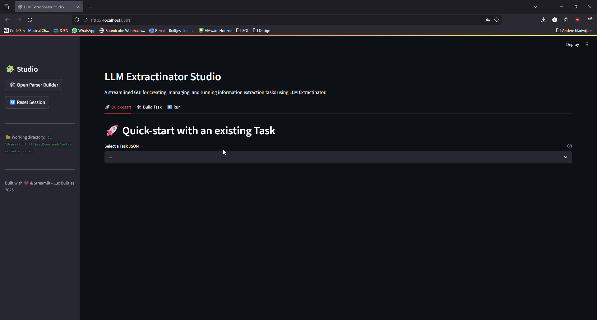

# The Studio

The Studio is the **interactive, no-code** way to use LLM Extractinator. Launch it with:

```bash
launch-extractinator
```

This starts a Streamlit app, usually at [http://localhost:8501](http://localhost:8501).



Everything you do in the Studio produces the same task files and output as the CLI — so you can prototype here, then run the exact same task unattended on a server.

---

## Layout at a glance

The Studio follows a straight-line flow, left to right:

**Task → Run → Results**

A **status strip** under the header always shows where you stand — the current **Task**, the **Model**, and the **Latest run** — so you never lose track of state as you move between tabs. The dots turn teal once each is set.

The working directory (where it reads `data/`, `tasks/`, and writes `output/`) is shown in the sidebar, along with a **Reset session** button that clears your current selections.

---

## 1. Task

This is where you get a task ready to run. A toggle at the top offers two paths:

### Use an existing task

Pick any `Task*.json` from your `tasks/` folder. The Studio shows a friendly summary — description, dataset, text column, output schema, and examples — with the raw JSON tucked into an expander. Click **✅ Use this task** to mark it ready and unlock the Run tab.

### Build a new task

A three-step form:

1. **Inputs** — choose (or upload) your dataset, pick the **text column**, choose or build the **output schema**, and optionally add an examples file.
2. **Describe** — write the plain-language task description and confirm the auto-suggested Task ID.
3. **Review & save** — check the summary and click **💾 Save task**. It's written to `tasks/Task<NNN>.json` and marked ready.

#### The Output Schema Builder

Next to *Output schema*, **🛠️ Build new** opens the schema builder in a pop-up. Add fields (types, collections, `Literal`s, nested models), preview the generated Python, then **Save & use this schema** — it lands in `tasks/parsers/` and is selected for your task automatically. You can also select a previously built schema, or upload your own `.py`.

The builder is also available on its own via `build-parser`. See [Output schema](parser.md) for the details of what you can build.

---

## 2. Run

Available once a task is ready.

The tab is built around what a run actually varies. **Task**, **Model** and
**Scope** sit in a single row at the top with the **Run** button; everything else
is an override, folded into one **Settings** panel below. Most runs never open it.

### The launch bar

- **Task** — which task file to execute.
- **Model** — pick from the models installed on your Ollama server, or type any
  Ollama model name (it will be pulled on first use). If no server is reachable
  the name is free text and is not checked.
- **Scope** — *Full dataset*, or *Test run* to process only a handful of rows as
  a sanity check before committing to the real thing. Choosing a test run reveals
  the row count (default 5) and an optional *Random* sample. Output lands in its
  own `-test<N>-run…` folder marked 🧪 in **Results**, and because the row count
  is part of that folder name, trying 5 rows and then 50 gives you two separate
  folders rather than the first result twice. The context window is still sized
  from the full dataset, so the check reflects the run it stands in for.

Under the row is a strip of chips showing the settings that will actually be
used — model, scope, context, reasoning, max tokens — with anything differing
from a plain full run highlighted. **Show command** reveals the exact CLI
invocation. If a configuration cannot work, **Run** is disabled and the reason is
stated above it rather than left for the run to discover.

### Settings

Four groups, each answering one question.

**Hardware** — where the model runs and what has to fit on the card.

- **Ollama server URL** *(optional)* — leave blank to let the tool manage its own
  local Ollama, or enter a URL to connect to an **already-running instance** —
  Ollama on your host, or a shared GPU server. This is the field you use when
  running the container without its own Ollama (see [Connecting to an existing
  Ollama instance](docker.md#5-connecting-to-an-existing-ollama-instance)).
  Common values are `http://host.docker.internal:11434` (host machine) or
  `http://<server-ip>:11434` (remote). The model must already be pulled there.
  See also [`--ollama_host`](settings-reference.md).
- **Recommended settings** — pick a tier for your GPU and click **Apply**. It
  fills in the model and the context ceiling; every field stays editable
  afterward. It is an action rather than a mode, so nothing keeps claiming your
  configuration is "Medium" once you have edited it by hand.

    The ceilings are computed rather than guessed — quantised weights plus an f16
    KV cache, fitted into 85% of the card:

    | Tier | Model | Weights | Context ceiling |
    |---|---|---|---|
    | High (40GB+) | `qwen3.5:35b` | 22.4 GiB | 262,144 |
    | Medium (12GB) | `phi4:14b` | 8.5 GiB | 8,192 |
    | Low (8GB) | `qwen3:4b` | 2.3 GiB | 16,384 |

    Two results there are worth knowing. **High needs 40GB and will not fit a
    24GB card** — the weights alone are 22.4 GiB. And **Low allows a longer
    context than Medium**, which is not a typo: `qwen3.5:35b` is a
    mixture-of-experts model with hybrid attention, so only 10 of its 40 layers
    keep a KV cache (20 KiB/token against phi4's 200 KiB/token), while the tiny
    `qwen3:4b` simply leaves far more of its card free than `phi4:14b` does.

    Neither reasoning nor max output tokens belongs to a preset. Reasoning is
    detected at run time once the model has been pulled, which beats any fixed
    guess; output length follows your schema, not your GPU.

- **Cap context length** — bounds the window in **max**/**split** mode. The
  window still fits your data, it just never grows past the ceiling, which is
  what keeps a run inside a GPU's memory.
- **Process in chunks** — write each chunk to disk before starting the next, so
  an interrupted run can resume and completed chunks are skipped.

**Generation** — how the model produces text. Every control here is an override;
left alone, the run decides.

- **Reasoning** — *Auto*, *On* or *Off*. Leave it on **Auto**: the run inspects
  the model once it has been pulled and enables reasoning if it thinks, which is
  right almost every time. *On* forces it for a model that cannot be inspected
  yet; *Off* makes a thinking model answer directly.

    Reasoning is deliberately *not* seeded from that detection. A control that
    starts as "whatever we could see at the time" freezes the wrong answer when
    you apply a preset before entering a server URL — there is no server to ask
    yet, so the answer is "not a thinking model", and the real answer never gets
    a chance to replace it.

- **Set temperature manually** — off by default, and best left there: 0.0
  (greedy) for an ordinary model, 0.6 for a thinking one, which Qwen's own
  guidance requires.
- **Set max output tokens manually** — also off by default. Left alone, the
  budget is derived from your output schema — three enum fields and thirty
  free-text ones need very different amounts — with the chain-of-thought
  allowance added on top for a thinking model. Set it only to override that.
- **Top-k / Top-p** — off unless you switch them on.

**Prompt** — what the model is shown for each row: the few-shot example count and
the context-length strategy (**max**, **split** or a fixed size).

**Execution** — repetition and bookkeeping: number of runs, a fixed seed,
*Overwrite existing output* (without it, a run whose output folder already exists
is skipped and the previous results kept), and verbose logging.

### While it runs

Clicking **Run** replaces the form with a run view, because during the one period
when you cannot change anything there is no reason to show you everything you
could change. You get progress in rows, elapsed time, the resolver's budget line
— `context 4096 = 1119 prompt + 512 answer + 2465 headroom` — pulled out of the
log where it would otherwise scroll past, and the full log behind a toggle.

**Stop** ends the run. It terminates rather than kills, so `extractinate` still
gets to shut down the Ollama server it started; anything already written to disk
stays there.

When the run finishes you get record counts, a pointer to the output folder, and
**New run** to go back to the form. A run with failures also writes
`failures.json` next to its predictions, with the model's own output for each
failed row.

---

## 3. Results

Explore the output of any run — newest first, with the run you just finished auto-selected.

- **Summary metrics** — total records, successes, and failures at a glance.
- **Filters** — show all / successes / failures, plus a free-text search across every field.
- **Records table** — a compact overview; extracted list/dict fields are summarised (e.g. "3 items").
- **Detail view** — select a row to see the full record side by side: input/metadata on the left, extracted fields on the right.

What the records actually contain is covered in [Understanding output](output.md).

---

## Why use the Studio

- You don't have to remember CLI flags — it guides you through the required fields.
- You can build and swap output schemas quickly and see results without leaving the app.
- It's the fastest way to iterate on a task before committing it to an unattended CLI run.

Once you're happy, run the same task from the [CLI](cli.md) on a workstation or server.
